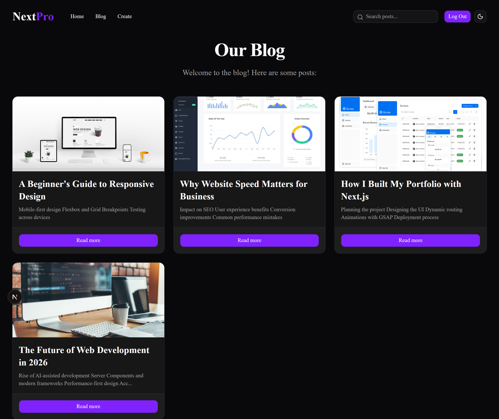

# ✍️ NextPro – Blogging Platform

A modern full-stack blogging platform built with **Next.js, TypeScript, and Convex**, designed for creating, discovering, and sharing stories, ideas, and knowledge.

---

## 🌐 Live Project

🚀 **[Visit the Live Website →](https://my-app-seven-ivory-42.vercel.app/)**

---

## 📌 About The Project

NextPro is a modern blogging platform that provides a clean and interactive space for users to read, create, and share blog posts.

The application is built with **Next.js** and **TypeScript**, with **Convex** handling the backend and data layer. It includes user authentication, post creation, global search, and a responsive interface built with modern UI components.

---

## 📸 Screenshots

### 📝 Blog Platform



---

## ✨ Features

- 📝 Create and publish blog posts
- 📖 Browse and read posts
- 🔍 Global post search
- 👤 User authentication
- 🔐 Sign up and login
- 🖊️ Create and manage content
- ⚡ Real-time backend with Convex
- 🎨 Modern and responsive UI
- 🌙 Theme support
- 🧩 Reusable UI components

---

## 🛠️ Tech Stack

### Frontend

- Next.js
- React
- TypeScript
- Tailwind CSS

### Backend

- Convex

### UI

- Shadcn UI
- Lucide Icons

### Tools & Deployment

- Git
- GitHub
- npm
- Vercel

---

## 🏗️ Application Architecture

```text
                         User
                          │
                          ▼
                  Next.js Application
                          │
             ┌────────────┼────────────┐
             │            │            │
             ▼            ▼            ▼
           Pages      Components      Search
             │            │
             └────────────┼────────────┘
                          ▼
                        Convex
                          │
                          ▼
                       Database
```

## 📁 Project Structure

```text
NextPro-Blog/
├── app/             # Next.js pages and routes
├── components/      # Reusable UI components
├── convex/          # Convex backend and database functions
├── lib/             # Utility functions
├── public/          # Static assets
├── .gitignore       # Git ignored files
├── next.config.ts   # Next.js configuration
├── package.json     # Dependencies and scripts
├── proxy.ts         # Application proxy
└── tsconfig.json    # TypeScript configuration
